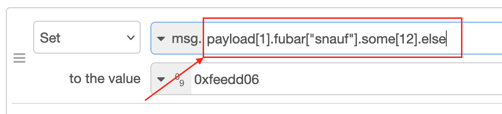
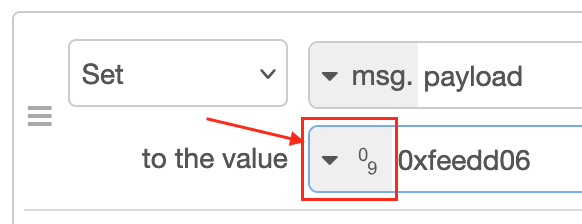
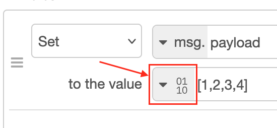

Erlang-Red Parser Collection
=====

Besides the [JSONata](https://github.com/gorenje/erlang-red-jsonata) parser, there are a few other things that need parsing in Node-RED. This is needed because Node-RED is NodeJS and uses much Javascript syntax.

Hence this is a collection of parsers to better handle the specifics of Node-RED.

## 1. Attribute Access parser

Node-RED is based on NodeJS which has many access the keys inside an object, mixing array indices with hash keys:

    fubar[1]['1'].keyname // [1] is array, '1' is key name
    'fubar'.keyname["anotherkey"] // all keynames

There are many possible combinations which aren't really handled with a single regular expression.

This attribute access can be used anywhere, both for retrieval and setting values:

## 2. Number Type parser

Again, Javascript and hence Node-RED are very literal in interpreting numbers, a semi complete [test](https://flows.red-erik.org/f/fb50bac16667fc54) has just some examples.

The field symbolic for this parser:

Node-RED also extends this interpretation to include numbers defined as hexadecimal and binary:

    0xfeedbabe // 4276992702
    0b10101110 // 174

So that all needs to be supported by some kind of parser. My favourite valid number in Node-RED is negative zero: `-.0e-1`.

## 3. Buffer Type parser

A rarely used type for my usage, it is hidden behind the buffer field:

This type defines a Javascript Buffer object which is basically just binary data, i.e. byte-wise data stored in a Buffer object.

This matches nicely with binary values in Erlang, so this parser handles that. It generates a list of numbers and it is up to the caller to convert that to whatever they like.

Example of the strings that this parser expects:

    [1,2,3,4,5]
    [0x34, 0b111]
    [0b111, 0b101, 0b110]

But that's where this parser goes beyond what Node-RED does. Node-RED assumes that the value defined in a buffer type is parsable JSON array string, meaning that hexadecimal and binary definitions aren't supported.

Node-RED errors out on the last two examples above.

I find this restriction just that: a restriction. So this parser is more liberal and can handling this hexadecimal and binary specifications for numbers.

This parser returns a list of Numbers, meaning floats are included and negative numbers also. The buffer type will reduce to this to a set of positive byte values. But that is done over at Erlang-Red, not here.

Why?
----

Because Erlang makes it too easy to create leex/yacc parsers, so might as well use them!

Build
-----

    $ rebar3 compile
